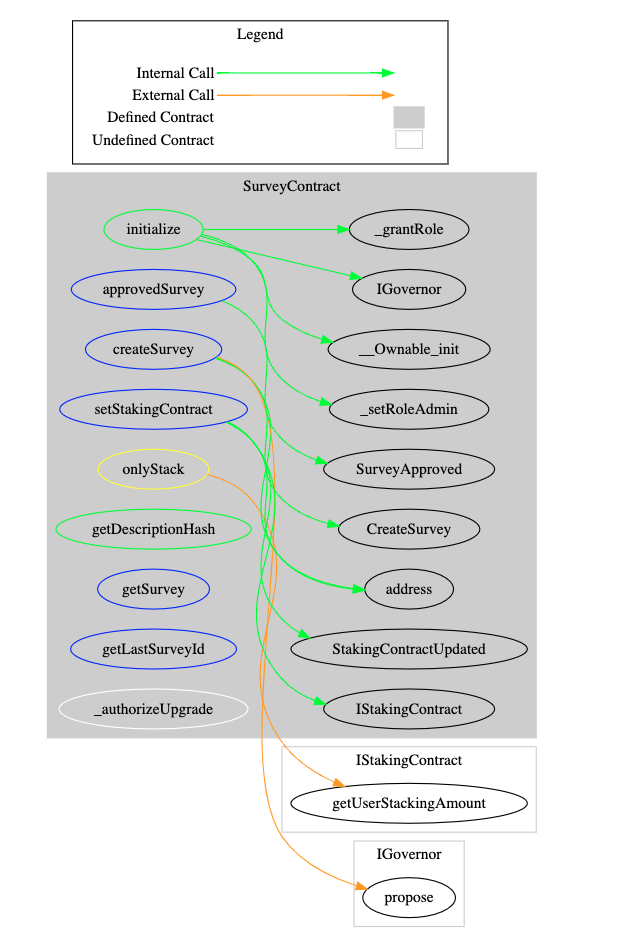

# Survey DAO

# Governance Token Staking and Voting System Overview

### Objective
Challenge: The company wants to create a platform where users could stake their tokens. This will allow users
to participate in (vote) different Surveys. When a user stakes some amount of a particular token (ex: BAR) it
gives them the possibility to vote on any survey linked to that token (ie: BAR).

Design an upgradeable smart contracts architecture to tackle this challenge. Consider security risks and
maintainability.
Describe possible improvements. Eventually provide a diagram.

### Solutions

To solve this challenge, I utilized `OpenZeppelin Governance`. This framework allows users to stake tokens that are whitelisted and, in return, receive `Governance Tokens`. These tokens can later be used for voting in surveys related to the staked tokens. Below is a brief overview of the process and functionalities:

#### Token Staking and Governance Tokens

- Users can stake whitelisted tokens and receive an equal amount of Governance Tokens in return.
- These Governance Tokens can later be used for voting in surveys associated with the staked tokens.

#### Survey Creation

- Any user who has staked their tokens can create a survey.
- Only one survey can be active at a time.

#### Unstaking Tokens

Users can unstake their tokens under the following conditions if any survey is created on that token:
  1. **The survey has not started yet** and is still in the pending state.
  2. **The survey is active**, but the user has not voted. Once a vote is cast, it's not possible to `unstake` until the survey moves to the `queue` or other states.

#### Survey Statuses

The possible statuses for surveys include:
- Pending
- Active
- Canceled
- Defeated
- Succeeded
- Queued
- Expired
- Executed

#### Voting

- Each user can vote only once.

#### Survey Progression

- Anyone can move the survey to the `queue` once the time is over, and then it can be moved to `execution`.

More details about the functions and the flow are given in the contract details.


#### Contract Details
Following image show you all the contract in this project with other important details like No lines of Code, total lines in one file with spaces, complex. score.


#### Contract Relations


We will discussed only `three` main contract in details and other are very well know and `open-source`

- GovernanceToken.sol
- StakingContract.sol
- SurveyContract.sol


#### GovernanceToken.sol
**ERC20 Smart Contract with Governance Voting Power**

This contract is an extension of the standard ERC20, incorporating a governance voting power feature. It allows users to participate in ongoing surveys with two main requirements:

- Users must stake their tokens.
- Users receive Governance tokens, granting them the power to vote.

#### Features and Access Control

- **Access Control**: The contract features access control mechanisms, ensuring that only authorized operations are performed.
- **Ownership**: The owner of the contract is the `StakingContract`. Only requests coming from this entity are allowed to mint new tokens.
- **Open Operations**: Any user can burn tokens and perform other tasks within the contract's allowances.

> This design ensures that while the contract remains secure and under the control of the `StakingContract`, it also provides flexibility and participation opportunities for the users.

##### Contract Intractions


#### StakingContract.sol

**Governance Voting Power System Overview**

This component serves as the heart of the project, empowering users with the ability to vote. It offers a variety of features aimed at enhancing the governance and staking processes.

##### Features for Contract Owner

The contract owner is endowed with several administrative capabilities:

- **Whitelist Tokens**: Ability to add new tokens to staking with `whitelistToken`.
- **Dewhitelist Tokens**: Option to remove unwanted tokens with `dewhitelistToken`.
- **Set Survey Contract**: Update the Survey Contract address in case of an upgrade with `setSurveyContract`.
- **Set Governance Token**: Update the Governance Token address in case of an upgrade with `setGovernanceToken`.
- **Transfer Governance Token Ownership**: Change the owner of the Governance Token during upgrades with `transferGovernanceTokenOwnership`.
- **Set Minimum Staking Amount**: Determine the minimum amount allowed for staking with `setMinStakingAmount`.

##### Stake Functionality

Users are allowed to deposit tokens under specific conditions:

- **Deposit Whitelisted Tokens Only**: Users can stake their tokens if they are whitelisted.
- **One-time Deposit**: Each user is allowed to deposit only once.
- **Receive Governance Tokens**: Users are awarded Governance Tokens, which provide the power to vote on surveys related to the staked tokens.
- **Voting Power**: Users gain the ability to vote on surveys specifically for the tokens they have staked.

##### Unstake Functionality

Users can retrieve their staked tokens under certain conditions:

- **No Active Surveys**: Users can unstake if no surveys are currently active or if no survey exists.
- **Active Survey with Unused Voting Power**: If a survey is active but the user hasn't used their voting power.
- **Post-Voting Period**: If the user has used their voting power and the voting period is over, moving the survey into the queue phase.

##### Utility Functions

Several getter functions are provided for user convenience:

- **`getTotalStaked`**: Retrieves the total amount staked in the contract.
- **`myStakeAmount`**: Allows users to check the amount they have staked.
- **`getUserStakingAmount`**: Provides the amount staked by a specific user.

These features and functions are designed to ensure a flexible and secure environment for token staking and governance through voting.
##### Contract Intractions


#### SurveyContract.sol

**Survey Contract Features Overview**

This contract introduces features related to managing surveys within the system. Below are detailed explanations of the functionalities provided by the contract.

##### Ownership and Permissions

The contract is designed with dual ownership and specific permissions for enhanced security and functionality:

- **TimeLock Contract**: Acts as the primary owner, with the exclusive permission to execute the `approvedSurvey` function once voting is over. This ensures actions are taken based on consensus and within a safe time frame.
- **Access-Based Control**: Implemented for critical functions such as `setStakingContract` and `_authorizeUpgrade`. These functions are safeguarded to prevent unauthorized access and modifications.

##### Survey Creation

- **Restricted Creation**: Only users who have participated in staking by depositing tokens are allowed to create surveys with the `createSurvey` function. This encourages active participation and ensures that only stakeholders have a say in survey matters.

####### Getter Functions

Several utility functions are available to users for querying contract states and information:

- **`getDescriptionHash`**: Retrieves the hash of a survey description, useful for identifying and referencing surveys.
- **`getSurvey`**: Provides details of a specific survey, including its status and contents.
- **`getLastSurveyId`**: Fetches the ID of the most recent survey, allowing users to easily find the latest survey information.

These features aim to facilitate a transparent, secure, and user-centric survey process within the governance system.

##### Contract Intractions



#### GovernorContract.sol & TimeLock.sol
 **OpenZeppelin Contract Features Overview**

OpenZeppelin contracts are open-source but offer robust support and a wealth of features to streamline the development of decentralized applications.

###### GovernorContract Features

The GovernorContract is designed to facilitate governance through user participation and decision-making processes:

- **Voting**: Allows users to vote on surveys, enabling stakeholder participation in governance decisions.
- **Survey Status**: Users can check the current status of surveys, keeping all participants informed.
- **Status Transitions**: Provides the functionality to move surveys through different stages, such as from pending to action, and action to queue.
- **Result Compilation**: Results are compiled based on predefined percentage criteria to determine if a survey wins or loses.
- **Voting Parameters**: Offers extensive features to set voting parameters, such as the start time, duration, and end of voting periods.

##### TimeLock Feature

TimeLock works in conjunction with the GovernorContract to enhance governance procedures:

- **Supportive Details**: Offers supportive details to the GovernorContract, aiding in the smooth execution of governance actions.
- **Real Owner**: Acts as the real owner by executing the final actions, owning the survey decisions in our scenario.

These components work together to create a transparent, secure, and efficient governance framework, leveraging the strength of OpenZeppelin's open-source contracts.
##### Contract Intractions


#### Upgade Proxy
**UUPS Upgradeability in the Project**

In this project, we have adopted the UUPSUpgradeable approach from OpenZeppelin to ensure that our contracts are future-proof and can be upgraded in response to new requirements or to address any issues that may arise. This section provides a brief overview of UUPSUpgradeable and explains its implementation within the project.

##### Understanding UUPSUpgradeable

UUPS (Universal Upgradeable Proxy Standard) is a smart contract upgradeability pattern that allows for more gas-efficient contract upgrades compared to other proxy-based upgradeability patterns. It leverages the proxy pattern without requiring a separate proxy for each contract instance, thereby reducing deployment and execution costs.

##### Key Features of UUPSUpgradeable:

- **Economy**: It is more gas-efficient in terms of deployment and future upgrades.
- **Decentralization Friendly**: The logic contract can be upgraded by the contract itself, not just by an external admin, aligning with decentralization principles.
- **Transparency and Security**: The pattern allows for transparent and secure upgrades, ensuring that contract behavior can be altered only as intended by the governance mechanism or predefined rules.

##### Upgradeable Contracts in the Project

Within our project, the following contracts are made upgradeable using the UUPSUpgradeable approach, ensuring they remain adaptable and secure:

- **GovernanceToken.sol**: This contract manages the governance tokens that are crucial for participating in the voting process within the ecosystem.
- **StakingContract.sol**: It handles the staking mechanism, allowing users to stake tokens in exchange for governance tokens and participate in governance.
- **SurveyContract.sol**: This contract manages the creation, participation, and governance of surveys, facilitating decentralized decision-making.

By employing UUPSUpgradeable, we ensure that these core components of our governance system can evolve over time without sacrificing the integrity, security, or continuity of the deployed contracts or the overall system.

##### Conclusion

Adopting the UUPSUpgradeable approach provides our project with the flexibility needed to navigate the rapidly changing landscape of blockchain technology and decentralized governance, ensuring that we can continuously improve and adapt our contracts to meet the community's needs and address future challenges.


#### Security Check
To ensure the security of our contracts, we have conducted rigorous unit testing and used security analysis tools such as Slither and Aderyn. The findings and recommendations from these tools can be found in our [security report](./report.md).

##### Security Suggestions and Improvement Needs

In addition to the initial security measures, we identify several key areas for enhancement to further secure and optimize our blockchain project:

##### Decentralization of Contracts

- **Objective**: Increase the decentralization of all contracts, including `GovernanceToken.sol`, `StakingContract.sol`, and `SurveyContract.sol`, by adopting a DAO (Decentralized Autonomous Organization) structure. This minimizes the need for centralized control and reduces reliance on single-user involvement.

##### Use of Diamond Storage for Upgrades

- **Recommendation**: Implement Diamond Storage (EIP-2535) for a more flexible and efficient contract upgrade mechanism. This approach allows for modular contract architecture, making it easier to update and add new functionalities.

### Custom Governance Contract and Time Lock

- **Suggestion**: Customize the Governance Contract and Time Lock to overcome specific limitations and incorporate custom logic suited to the project's unique requirements. Tailoring these components ensures that governance and operational protocols align precisely with project goals.

##### Conclusion

By implementing these improvements, our project will not only enhance its security but also ensure its adaptability and sustainability within the dynamic blockchain ecosystem. Embracing full decentralization, advanced upgradeability techniques, and customized governance mechanisms will significantly contribute to the project's resilience and success.

#### Unit Test Coverage 

``` javascript
--------------------------|----------|----------|----------|----------|----------------|
File                      |  % Stmts | % Branch |  % Funcs |  % Lines |Uncovered Lines |
--------------------------|----------|----------|----------|----------|----------------|
 src/                     |    98.41 |    66.67 |    86.21 |    98.81 |                |
  GovernanceToken.sol     |     87.5 |    33.33 |    66.67 |     87.5 |             43 |
  StakingContract.sol     |      100 |    68.42 |    92.86 |      100 |                |
  SurveyContract.sol      |      100 |       75 |    88.89 |      100 |                |
 src/governance_standard/ |       80 |      100 |    83.33 |       80 |                |
  GovernorContract.sol    |       80 |      100 |    81.82 |       80 |         75,107 |
  TimeLock.sol            |      100 |      100 |      100 |      100 |                |
 src/interfaces/          |      100 |      100 |      100 |      100 |                |
  IGovernanceToken.sol    |      100 |      100 |      100 |      100 |                |
  IStakingContract.sol    |      100 |      100 |      100 |      100 |                |
  ISurveyContract.sol     |      100 |      100 |      100 |      100 |                |
 src/mock/                |    33.33 |      100 |    33.33 |    33.33 |                |
  ERC20Mock.sol           |    33.33 |      100 |    33.33 |    33.33 |          36,40 |
--------------------------|----------|----------|----------|----------|----------------|
All files                 |    93.42 |    66.67 |    81.82 |    94.85 |                |
--------------------------|----------|----------|----------|----------|----------------|
```


# Project Setup and Testing Guide

Follow these steps to install dependencies, run a local Hardhat node, execute tests, and check test coverage for the TASL-2 project.

## Step 1: Install Dependencies

Navigate to the project directory and install the necessary npm packages:

```bash
cd TASK-2
npm install
``` 

Step 2: Run Hardhat Node
Start a local Hardhat node for development and testing:

```bash

hh node
```

Step 3: Run Tests
Execute the project tests against the local Hardhat network:

```bash
hh test --network localhost
```

Step 4: Check Test Coverage
To evaluate the test coverage of your smart contracts, run the following command:

```bash

hh coverage
```